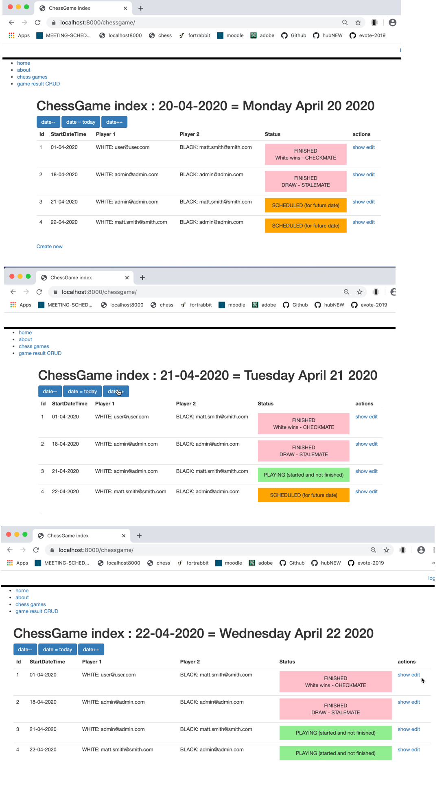

# symfony5-chess-date-status

Example of  dynamically changing displayed status of an event based on current date (in this example, date from session to allow us to change it)

The work is being done in:

- `/src/Controller/ChessGameController.php`

- `/templates/chess_game/index.html.twig`
  



https://github.com/dr-matt-smith/php-symfony-5-book-codes

- different CSS for status of game:
    
    ```twig
    
    <style>
    
        .finished {
            text-align: center;
            padding: 1rem;
            background-color: pink;
        }
    
        .scheduled {
            text-align: center;
            padding: 1rem;
            background-color: orange;
        }
    
        .playing {
            text-align: center;
            padding: 1rem;
            background-color: lightgreen;
        }
    </style>
    
    ```

- logic for each chess game object based on finished Boolean, and different between today (from session) and date of the game start property

    ```twig
    
        <tr>
            <td>{{ chess_game.id }}</td>
            <td>{{ chess_game.startDateTime|date('d-m-Y') }}</td>
            <td>WHITE: {{ chess_game.player1White}}</td>
            <td>BLACK: {{ chess_game.player2Black}}</td>
            <td>
    
                
    
                {# ----------- if completed is TRUE, status = completed -------- #}
                
                    <div class="finished">
                        FINISHED
                        <br>
                        {{ chess_game.result }}
                    </div>
                
                    {# ----------- if today BEFORE startDate then status = scheduled -------- #}
                    
                        <div class="scheduled">SCHEDULED (for future  date)</div>
                    
                        {# ----------- else game must be = playing -------- #}
                        <div class="playing">PLAYING (started and not finished)</div>
                    
                
            </td>
    ```
  
- links to change date stored in session 
    
    ```twig
        <a class="btn btn-primary" href="{{ path('chess_game_date_decrement') }}" role="button">date--</a>
        <a class="btn btn-primary" href="{{ path('chess_game_date_today') }}" role="button">date = today</a>
        <a class="btn btn-primary" href="{{ path('chess_game_date_increment') }}" role="button">date++</a>
    ```

- controller methods for the date changes

```php
    use Symfony\Component\HttpFoundation\Session\SessionInterface;
    
    /**
     * @Route("/chessgame")
     */
    class ChessGameController extends AbstractController
    {
        private $session;
    
        public function __construct(SessionInterface $session)
        {
            $this->session = $session;
        }
    
    
        private function getDateFromSession()
        {
            $default = $today = new \DateTime('NOW'); // today
            $dateFromSession = $this->session->get('today', $default);
    
            return $dateFromSession;
        }
    
        private function setDateInSesson($date)
        {
            $this->session->set('today', $date);
        }
    
        /**
         * @Route("/dateIncrement", name="chess_game_date_increment", methods={"GET"})
         */
        public function dateIncrement(): Response
        {
            $date = $this->getDateFromSession();
            $newDate = $date->modify('+1 day');
            $this->setDateInSesson($newDate);
            return $this->redirectToRoute('chess_game_index');
        }
    
        /**
         * @Route("/dateToday", name="chess_game_date_today", methods={"GET"})
         */
        public function dateToday(): Response
        {
            $newDate = new \DateTime('NOW');
            $this->setDateInSesson($newDate);
            return $this->redirectToRoute('chess_game_index');
        }
    
        /**
         * @Route("/dateDecrement", name="chess_game_date_decrement", methods={"GET"})
         */
        public function dateDecrement(): Response
        {
            $date = $this->getDateFromSession();
            $newDate = $date->modify('-1 day');
            $this->setDateInSesson($newDate);
            return $this->redirectToRoute('chess_game_index');
        }
```
  
- Timezone: I added this line 'date_default_timezone_set("Europe/Dublin");' in file `/src/Kernal.php`:
    
    ```php
    class Kernel extends BaseKernel
    {
        use MicroKernelTrait;
    
        private const CONFIG_EXTS = '.{php,xml,yaml,yml}';
    
        public function registerBundles(): iterable
        {
            date_default_timezone_set("Europe/Dublin");
    
    
            $contents = require $this->getProjectDir().'/config/bundles.php';
            foreach ($contents as $class => $envs) {
                if ($envs[$this->environment] ?? $envs['all'] ?? false) {
                    yield new $class();
                }
            }
        }
    ```


  
